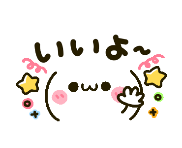

<p align="center">
    
</p>

<h1 align="center">
    <b>Kaomoe</b> (*￣▽￣)b
</h1>

<p align="center">
    Kaomoji<sup>顏文字</sup> + Moe<sup>萌</sup> = Kaomoe
</p>

# Notice
This repo is a fork of [antfu/kaomo](https://github.com/antfu/kaomo).(￣ω￣)

# New Feature
Add a web server for funny usage.(„• ֊ •„)

# Usage
## Use `CLI` to generate Kaomoji:

```shell
pnpm run dev
```

## Use `web server` to generate Kaomoji:

```shell
pnpm run server
```

## Refresh Kaomiji List
```shell
pnpm run fetch
```

## Build
```shell
pnpm run build
```
